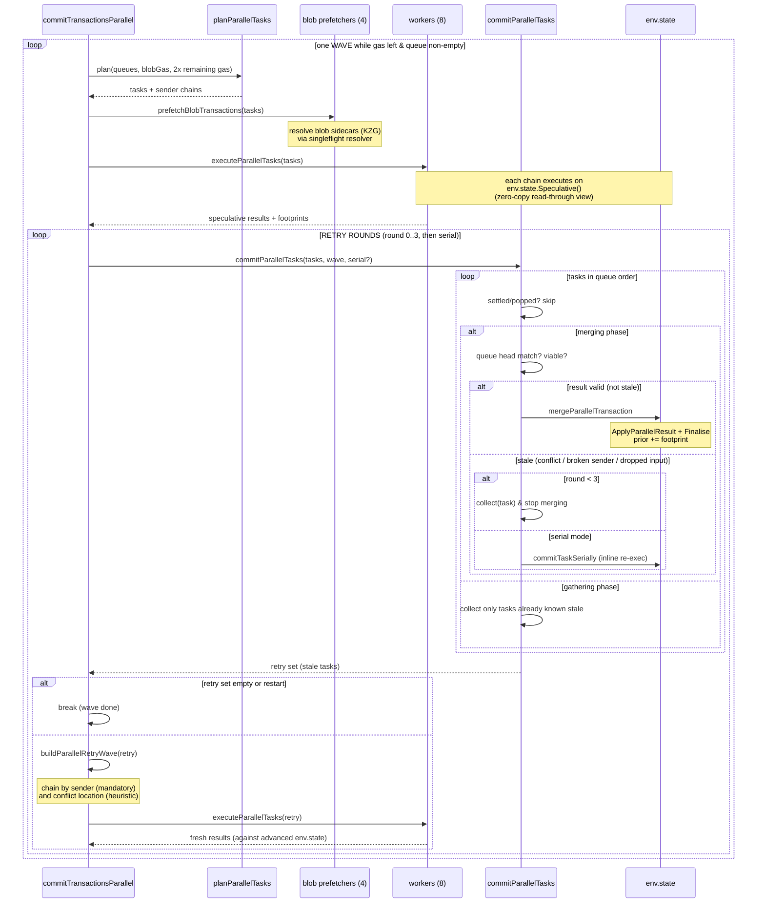

# Parallel Block Building — Code Walkthrough

This document traces `miner/parallel.go` with concrete transactions. Every
scenario names the exact functions and branches that fire, so you can read it
side by side with the code.

---

## 1. The pipeline in one picture

```
commitTransactionsParallel                 (the orchestrator, one call per queue pair)
│
└── loop: one WAVE per iteration, until block full or queues empty
    │
    ├── planParallelTasks        take ~one block's worth of txs off (copies of)
    │                            the queues; link same-sender txs into chains
    │
    ├── prefetchBlobTransactions start 4 goroutines resolving blob sidecars (KZG)
    ├── executeParallelTasks     8 workers speculatively execute every task
    │                            against a zero-copy view of env.state
    │
    └── loop: RETRY ROUNDS (round 0,1,2,... max 3, then serial)
        │
        ├── commitParallelTasks  walk tasks in queue order:
        │                          merge valid results into env.state,
        │                          stop at the first stale task,
        │                          collect everything already known stale
        │
        ├── buildParallelRetryWave  chain the stale tasks (by sender + by
        │                            conflict location)
        └── executeParallelTasks    re-execute them in parallel; loop back
```

Three stages, reused for both the initial wave and every retry round:
**plan → execute (parallel) → commit (serial, ordered)**.

---

## 2. Cast of characters

### Data structures

| Term | What it is |
|---|---|
| `parallelTask` | One transaction in the planned order. Carries its speculative `result`, its `chain`, and retry bookkeeping. |
| `parallelSenderChain` | Shared speculative state for tasks that must run one-after-another (same sender in round 0; same sender *or* same conflict location in retry waves). Also serves as the **chain identity** for validation. |
| `task.execChain` / `task.execIndex` | *Which chain* the latest execution ran on and *at what index*. Everything earlier in that chain was visible to the execution. |
| `task.priorBase` | How many results were already committed when this execution launched. Those were visible through `env.state`. |
| `task.settled` | Finished — merged or permanently dropped. Skipped by later passes. |
| `task.retried` | Re-executed at least once (decides `firstAttemptCommits` vs `retriedCommits`). |
| `task.conflictKey` | Location of the last detected conflict; used to group retry chains. |
| `wave.prior` | Footprints of everything committed in this wave so far, in commit order. |
| `wave.poppedSenders` | Senders removed from the queues; their remaining tasks are skipped. |
| `brokenSenders` (per pass) | Senders whose chain state went stale mid-wave; their later txs must re-execute. |
| `droppedChains` (per pass) | Per chain: the lowest link whose result did **not** commit. Later links of that chain saw phantom writes and must re-execute. |

### Validation rule (`parallelResultConflict`)

A task's result conflicts with an earlier committed result **unless** one of
these makes that result an *input* the execution already saw:

1. `i < task.priorBase` — it was committed before this execution launched
   (visible through `env.state`).
2. `committed.sender == task.sender` — same sender, same chain in round 0.
3. `committed.chain == task.execChain && committed.chainIndex < task.execIndex`
   — an earlier link of the chain this execution ran on (its writes flowed
   through the shared chain state).

Otherwise: intersect this task's **reads** with the committed result's
**writes**. Any overlap → conflict → stale.

### Staleness triad (`commitParallelTasks`)

A task is stale when any of:
- **conflict**: read/write intersection with a non-input committed result;
- **broken sender**: an earlier same-sender tx was re-executed/dropped, so
  this task's chain state is fiction;
- **dropped input**: an earlier link of its execution chain never committed
  (`droppedChains`), so it speculated on a phantom write.

---

## 3. Sequence diagram — `commitTransactionsParallel`



---

## 4. Scenario walkthroughs

The cast for every scenario:

| Sender | Transactions | What they do |
|---|---|---|
| **Alice** | `A0, A1, A2` (nonces 0–2) | plain ETH transfers to distinct addresses |
| **Bob** | `B0` | calls `COUNTER` — `slot0 = slot0 + 1` (reads *and* writes slot 0) |
| **Carol** | `C0` | also calls `COUNTER` |
| **Dave** | `D0` | also calls `COUNTER`; `D1` transfers ETH |
| **Erin** | `E0` | blob transaction (2 blobs) |

Assume the priority queue orders them: `A0, B0, C0, A1, D0, A2, D1, E0`.
Task positions are their index in this order (A0=0, B0=1, …).

---

### Scenario 1 — happy path (no conflicts)

Only `A0, A1, A2, D1, E0` are pending (nobody touches `COUNTER`).

1. **Plan** (`planParallelTasks`): 5 tasks. Alice's three link into one chain
   (`A0.next = A1`, `A1.previous = A0`, `execIndex` 0/1/2); `D1` and `E0` get
   singleton chains. Planning consumes *copies* of the queues — the real
   queues are untouched.
2. **Prefetch**: one blob (`E0`) → a prefetcher calls `resolver.resolve`,
   builds the KZG proofs once; any worker reaching `E0` first would do it
   instead (singleflight — never twice).
3. **Execute** (`executeParallelTasks`): ready set = chain heads `{A0, D1, E0}`.
   Three workers run them concurrently, each on its own
   `env.state.Speculative()` view. When `A0` finishes, `A1` becomes ready
   (same chain, sees `A0`'s writes through the shared chain state), then `A2`.
4. **Commit round 0** (`commitParallelTasks`, `serialRetries=false`):
   walk tasks in order. Each task: matches queue head ✓, `checkTaskViable` ✓,
   not stale (validation finds no read/write overlap; `A1` vs `A0` is skipped
   by the same-sender/same-chain rules) → `mergeParallelTransaction` →
   `ordered.Shift()`, `task.settled = true`, footprint appended to
   `wave.prior`.
5. Retry set empty → wave done. Queues empty → outer loop breaks.

Metrics: `firstAttemptCommits = 5`, `conflicts = 0`, `waves = 1`, `retryRounds = 0`.

---

### Scenario 2 — a direct conflict and one parallel retry round

Pending: `A0, B0, C0, D0` (order: `A0, B0, C0, D0`). `B0`, `C0`, `D0` all
increment `COUNTER.slot0`.

**Execute (round 0)**: all four speculate against the *same* base state, so
`B0`, `C0`, `D0` each read `slot0 = 5` and write `slot0 = 6`.

**Commit round 0**:

| Task | What happens | Branch |
|---|---|---|
| `A0` | no overlap with anything | merge → `prior = [A0]` |
| `B0` | reads slot0; nobody in `prior` wrote it | merge → `prior = [A0, B0]` |
| `C0` | reads slot0 ∩ `B0` wrote slot0 → **conflict** | `collect(C0, conflict)` → `merging = false`, `conflictKey = slot0`, `brokenSenders[Carol]`, `droppedChains[C0.chain]` |
| `D0` | gathering phase: not broken, result valid, `parallelResultConflict` vs `prior` → conflicts with `B0` on slot0 | `collect(D0, conflict)` → `conflictKey = slot0` |

Retry set: `[C0, D0]`.

**`buildParallelRetryWave`**: `C0` starts a new chain (nothing registered
yet); its `conflictKey` (slot0) registers that chain under `byLocation`.
`D0`'s sender has no chain, but its `conflictKey` finds `C0`'s chain →
**`D0` is appended after `C0`** (`D0.previous = C0`, `execIndex` 0/1). One
chain, so they run *serially, seeing each other's writes* — that's the point:
a hot slot converges in one round instead of one round per contender.

`priorBase` is set to `len(wave.prior) = 2` for both: everything already
committed is an input, not a conflict candidate.

**Execute retry**: `C0` runs on `Speculative(env.state)` — env.state now
contains `A0 + B0`, so it reads `slot0 = 6`, writes 7. `D0` runs next on the
same chain, reads 7, writes 8.

**Commit round 1**:

| Task | What happens |
|---|---|
| `A0`, `B0` | `settled` → skipped |
| `C0` | validation: `prior[0..1]` skipped (`< priorBase`) → clean → merge |
| `D0` | `prior[2]` is `C0`: same chain, lower index → **input, skipped** → clean → merge |

Retry set empty → done. Metrics: `firstAttemptCommits = 2`,
`retriedCommits = 2`, `conflicts = 2`, `retryRounds = 1`,
`retryExecutions = 2`, `retries` (serial) `= 0`.

---

### Scenario 3 — broken sender chain propagation

Pending order: `A0, B0, A1, A2` where **`A0` also calls `COUNTER`**, and `B0`
conflicts with it.

**Commit round 0**: `A0` merges. `B0` reads slot0 ∩ `A0`'s write → conflict →
`collect(B0)`. Now the gathering phase sees `A1`: Alice is *not* broken
(nothing of hers failed), `A1`'s result is valid vs `prior` → **stays
pending, result intact**. Same for `A2`. Only `B0` retries.

Now flip it: pending order `B0, A0, A1, A2` and `B0` merges first, `A0`
conflicts with it. Then:
- `collect(A0)` → `brokenSenders[Alice]`, `droppedChains[AliceChain] = 0`.
- Gathering: `A1` → `brokenSenders[Alice] != nil` → `collect(A1, nil)`
  (counted as `senderChainInvalidations`). Same for `A2`.
- Retry wave: `bySender[Alice]` keeps all three in one chain, in order —
  nonce order is never violated.

---

### Scenario 4 — dropped input (phantom-write protection)

Continuing Scenario 2's retry chain `C0 → D0`, suppose that at commit round 1
the block has almost no gas left and `C0`'s gas limit no longer fits:

| Step | Code path |
|---|---|
| `C0`: `env.gasPool.Gas() < task.lazy.Gas` | `checkTaskViable` → `taskNotViable` → `pop(C0)`: queue `Pop()`, `poppedSenders[Carol]`, **`drop(C0)`** → `droppedChains[retryChain] = 0` |
| `D0`: staleness check | `sawDroppedWrite(D0)`: same chain, `execIndex 1 > 0` → **stale** |

`D0` read `slot0 = 7` — a value written by a transaction that will never be
in the block. Without the `droppedChains` check, that phantom write would be
merged and the block's state root would be wrong. Instead `D0` is collected
and re-executed against reality (`slot0 = 6`).

The same protection fires when a chain member is committed **serially**
(`commitTaskSerially`): the serial result may differ from what chain-mates
observed, so the entry carries `chain = nil` (nobody may skip validating
against it) and `drop(task)` forces observers to re-execute.

---

### Scenario 5 — gas exhaustion pops (no restart, no wasted work)

Pending: `A0, B0, C0, D1`, block has 60k gas left. `A0` (21k limit) merges,
leaving 39k. `B0` has a 100k limit:

- `B0`: `gasPool.Gas() < lazy.Gas` → `pop(Bob)` — Bob's remaining txs leave
  the queue, `invalid++`. **No restart**: the loop just continues.
- `C0` (30k limit): fits, validates, merges — its round-0 result is *still
  used* even though `B0` was dropped after `C0` executed, because `C0` never
  read anything `B0` wrote (and if it had: `B0` never committed, so there is
  nothing of Bob's in `prior` to conflict with, and `C0` isn't on Bob's
  chain).
- `D1`: fits, merges.

This is what `TestParallelBuildPayloadGasExhaustion` locks in:
`speculative <= planned + retryExecutions` — a pop never re-executes the rest
of the wave. (Before this design, any pop restarted and re-executed
everything remaining — the 6x over-execution in the first benchmark.)

---

### Scenario 6 — nonce too low (stale pool)

The pool thinks Alice's next nonce is 0, but `A0` was already included in the
previous block (pool lagging behind the chain head).

- Round 0 execution: `A0` fails inside `ApplyTransaction` with
  `ErrNonceTooLow`; its chain stops (`A1`, `A2` are never scheduled →
  `result == nil`).
- Commit: `A0` reaches the `task.result.err != nil` branch →
  `errors.Is(err, ErrNonceTooLow)` → `Shift()` (advance to Alice's next tx,
  matching the sequential builder), `settled`, `drop(A0)`,
  `brokenSenders[Alice]`, and in parallel mode `merging = false`.
- Gathering: `A1`, `A2` → broken sender → collected.
- Retry wave: fresh chain `A1 → A2`, executed against the canonical state —
  where `A1` is now perfectly valid (the real account nonce is 1). Both merge
  in the next pass.

---

### Scenario 7 — the serial fallback (round cap)

`parallelMaxRetryRounds = 3`. A pathological ordering can burn a round on a
single transaction: pending-valid tasks interleaved between contenders can
invalidate one more contender per round (each pass merges at least one task,
but conflicts keep cascading). After 3 parallel rounds,
`commitParallelTasks` runs with `serialRetries = true`:

- The staleness triad still applies, but instead of `collect`, each stale
  task goes through **`commitTaskSerially`**: re-executed inline on
  `env.state` (in commit order, so the fresh result cannot be stale), merged
  or dropped immediately.
- This pass touches every remaining task exactly once → the wave always
  terminates.

The serial path is also the behavior of the whole system before parallel
retries existed — the fallback is "the old code."

---

### Scenario 8 — multiple waves

The pool holds 3 blocks' worth of gas. `planParallelTasks` stops planning
when the sum of gas *limits* exceeds `2 × remaining block gas`
(`parallelPlanningGasFactor` — limits run ~2x actual usage, so one wave
usually fills the block). If the wave under-fills (transactions used less gas
than budgeted), the outer loop plans **wave 2** from wherever the queues now
stand, with a fresh `parallelWaveCommit`. Each wave speculates against the
env.state its predecessor left behind; `wave.prior` never crosses waves
because cross-wave results are already *in* the base state.

---

### Scenario 9 — blob transactions

`E0` carries 2 blobs.

- **Plan**: if `E0`'s blob gas exceeds the remaining blob budget, it is
  planned as a **sentinel** (`blobGasLimit = true`, no chain, never executed)
  and planning stops for this wave; commit pops it
  (`checkTaskViable` → `taskNotViable`) and the next wave replans.
- **Prefetch**: otherwise, one of the 4 prefetch goroutines resolves it —
  KZG cell-proof construction, the expensive part — while the 8 EVM workers
  run plain transactions. A worker that reaches `E0` before the prefetcher
  finishes blocks on the singleflight future (`resolveWaitNs` measures this);
  the work is never done twice.
- **Commit**: `mergeParallelTransaction` strips the sidecar
  (`WithoutBlobTxSidecar`), appends it to `env.sidecars`, and bumps
  `BlobGasUsed`.

---

### Scenario 10 — a worker panics

A bug in the speculative path makes `C0`'s execution panic.
`runParallelTask`'s `recover` converts it into a failed, incomplete result
(`result.state = nil`) and logs the stack at `Error`. At commit,
`parallelResultConflict` returns an *incomplete* conflict → in parallel mode
`C0` gets one fresh re-execution (`collect`); if it panics again, the
`task.retried` guard routes it to `pop` / the serial path. The node never
crashes; worst case the transaction's sender is dropped from this block.

---

## 5. Invariants worth remembering

1. **Block order is queue order.** Merging stops at the first stale task and
   never leapfrogs it; a parallel-built block is byte-identical to the
   sequential builder's block (`TestParallelBuildPayloadMatchesSequential`).
2. **`env.state` is quiescent during execution.** Results merge only after
   every worker has finished — that is what makes the zero-copy
   `Speculative()` views safe with no locks.
3. **Every merged result was validated** against everything committed after
   its execution launched, minus its declared inputs (priorBase / own chain).
   Nothing merges on trust.
4. **A dropped result invalidates its observers** (`droppedChains`), so
   phantom writes cannot reach the block.
5. **Termination**: every commit pass merges or drops at least one task, and
   after `parallelMaxRetryRounds` the serial pass finishes the wave
   unconditionally.
6. **Work is never duplicated on resolution** (singleflight resolver), and a
   pop never restarts the wave (`speculative ≤ planned + retryExecutions`).
